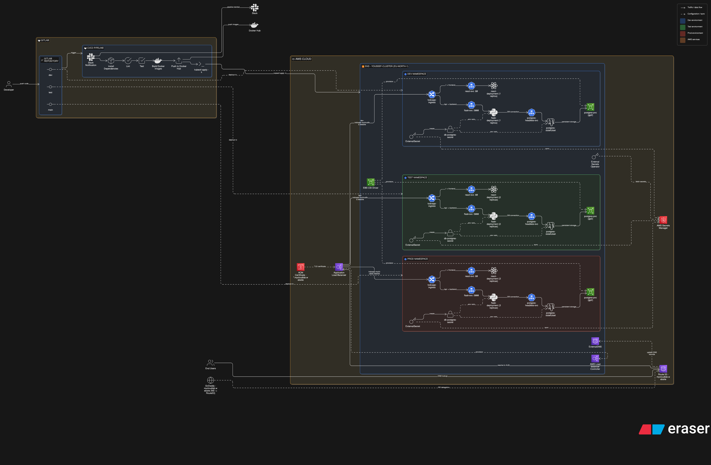
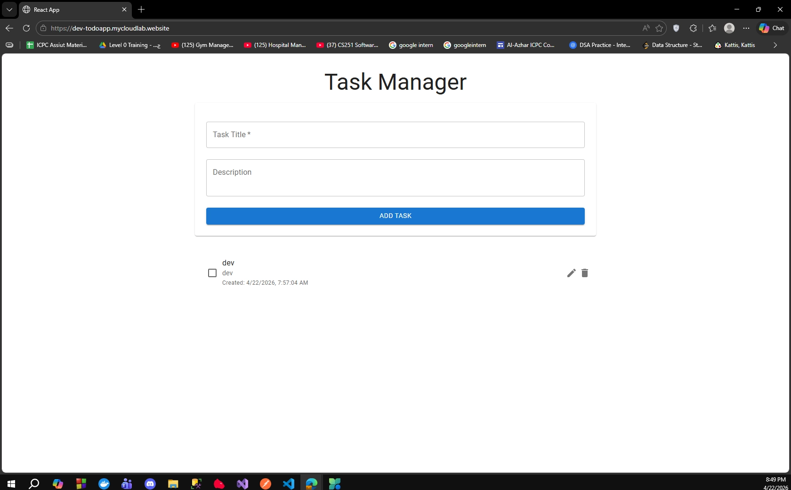
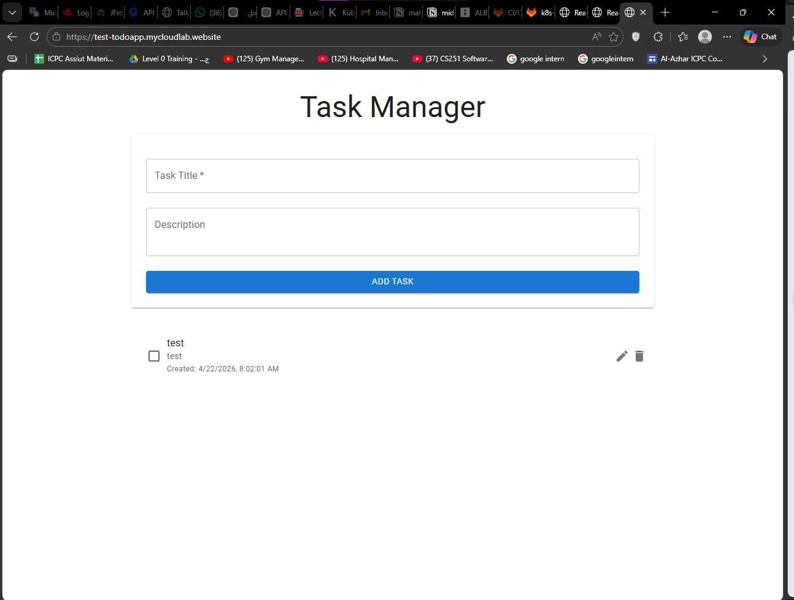
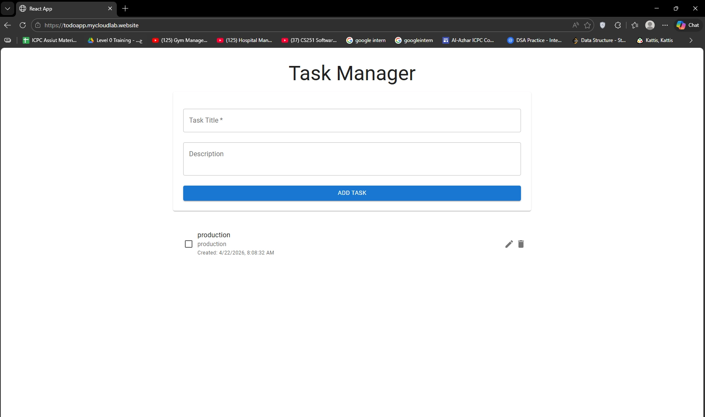
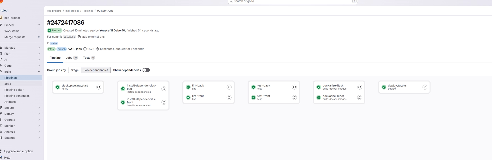
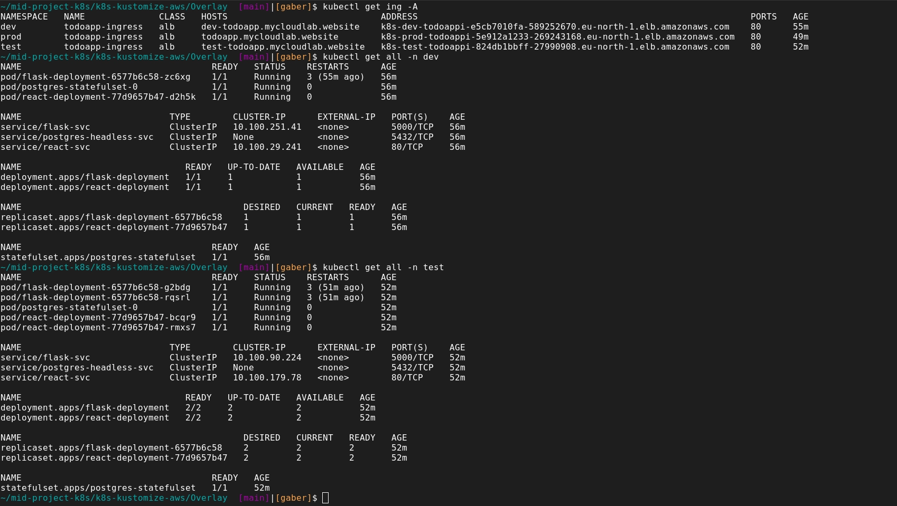
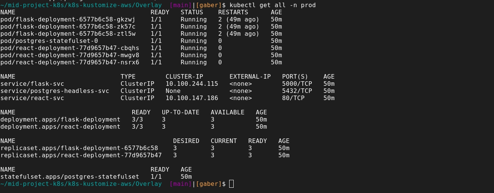
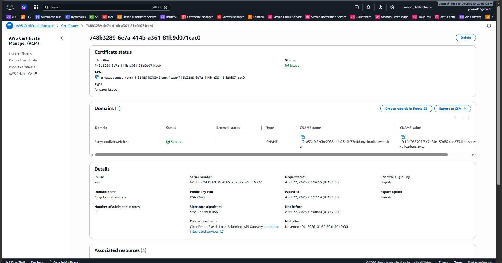
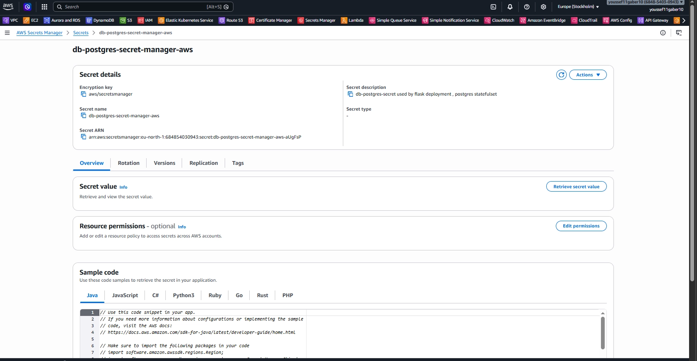
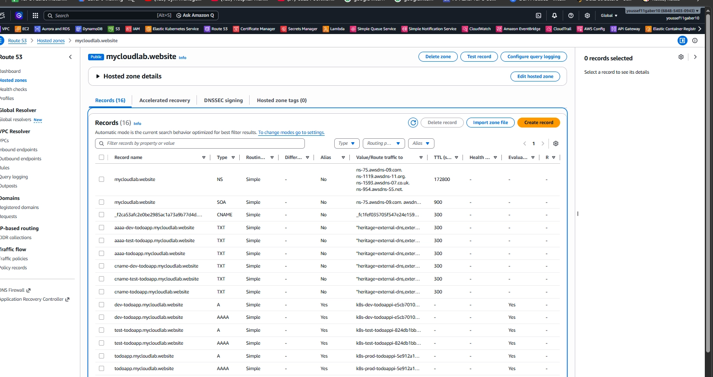

# Multi-Environment Kubernetes Deployment on AWS EKS

This project showcases a complete DevOps implementation for deploying a full-stack Todo application on Amazon EKS using a multi-branch GitLab CI/CD pipeline, environment-based Kubernetes overlays, and AWS-native integrations.

The goal is simple: every push to `dev`, `test`, or `main` automatically goes through the same quality gate and is deployed to its matching Kubernetes namespace:

- `dev` branch -> `dev` namespace
- `test` branch -> `test` namespace
- `main` branch -> `prod` namespace

---

## What I Built

- Multi-branch GitLab pipeline with stages for notifications, dependency installation, linting, testing, Docker build/push, and EKS deploy
- Kustomize-based Kubernetes manifests with base + environment overlays (`dev`, `test`, `prod`)
- Environment-specific ingress hostnames and replica scaling strategy
- Internet-facing AWS ALB Ingress with HTTPS termination using ACM certificate
- External DNS integration for automatic DNS record management in Route 53
- Secret management migrated from Kustomize `secretGenerator` to AWS Secrets Manager via External Secrets Operator
- PostgreSQL StatefulSet with persistent storage via PVC/StorageClass on EKS

---

## Architecture Overview

- **Application**: React frontend + Flask backend + PostgreSQL
- **Container Registry**: Docker Hub
- **Orchestration**: Amazon EKS
- **Config Management**: Kustomize (`Base` + environment overlays)
- **Ingress**: AWS Load Balancer Controller (ALB Ingress)
- **TLS**: AWS Certificate Manager (ACM)
- **DNS**: Amazon Route 53 with ExternalDNS
- **Secrets**: AWS Secrets Manager + External Secrets Operator
- **CI/CD**: GitLab CI
- **Notifications**: Slack webhook (pipeline start)

### Full Architecture Diagram

---

## CI/CD Pipeline Flow

Defined in `.gitlab-ci.yml`, the pipeline runs on `dev`, `test`, and `main` branches and executes:

1. **Notify**  
   Sends a Slack notification when the pipeline starts.
2. **Install Dependencies**  
   Installs frontend and backend dependencies with caching.
3. **Lint**  
   Runs frontend lint (`npm run lint`) and backend lint (`flake8`).
4. **Test**  
   Runs frontend tests and backend tests (`pytest`).
5. **Build & Push Images**  
   Builds React and Flask images and pushes to Docker Hub.
6. **Deploy to EKS**  
   Uses dynamic branch-to-overlay mapping:
   - `main` -> `prod`
   - `test` -> `test`
   - `dev` -> `dev`
   Then applies manifests with `kubectl apply -k`.

This enforces a consistent promotion model and reduces manual deployment risk.

---

## Branch-to-Namespace Strategy

The deploy job maps Git branches to Kubernetes namespaces and overlays:

- `dev` branch deploys to `dev` namespace
- `test` branch deploys to `test` namespace
- `main` branch deploys to `prod` namespace

This gives clear environment isolation while keeping one reusable deployment workflow.

---

## Kubernetes Add-ons / Integrations Used in EKS

These are the core add-ons/integrations used to operate production-style workloads on EKS:

- **AWS Load Balancer Controller** for ALB-backed Kubernetes Ingress
- **ExternalDNS** to manage Route 53 records from ingress annotations
- **External Secrets Operator** to sync Kubernetes secrets from AWS Secrets Manager
- **EBS-backed persistent storage** for PostgreSQL via StorageClass/PVC (CSI-based storage provisioning in EKS)

---

## Ingress, SSL, and DNS

Ingress is configured with ALB annotations and ACM certificate ARN:

- Internet-facing ALB
- HTTPS listener and HTTP->HTTPS redirect
- ACM certificate attached to ingress
- ExternalDNS hostname annotations per environment

Environment hostnames:

- `dev-todoapp.mycloudlab.website`
- `test-todoapp.mycloudlab.website`
- `todoapp.mycloudlab.website` (prod)

---

## Secret Management Journey

Originally, secrets were generated in Kubernetes manifests using Kustomize `secretGenerator`.

Then migrated to a more secure cloud-native model:

- Secrets stored in **AWS Secrets Manager**
- `ClusterSecretStore` configured to access Secrets Manager
- `ExternalSecret` resources sync required values into Kubernetes secrets (`db-postgres-secret`)

This improves security posture and centralizes secret lifecycle management.

---

## Environments and Scaling

Kustomize overlays define namespace-specific behavior:

- **dev**: lightweight replica count (1)
- **test**: medium replica count (2)
- **prod**: higher replica count (3)

This demonstrates controlled scaling and realistic environment sizing.

---

## Domain and DNS Ownership

- Public domain purchased from GoDaddy: `mycloudlab.website`
- Nameservers were updated to use AWS Route 53 nameservers
- Hosted zone records are then controlled through AWS (with ExternalDNS support)

---

## Evidence / Screenshots

### Application URLs

### CI/CD Pipeline

### Kubernetes Ingress and Workloads

### AWS Integrations

---

## Why This Project Demonstrates DevOps Strength

- Built a full CI/CD path from code commit to production-ready EKS deployment
- Implemented multi-environment release strategy using branch/namespace mapping
- Applied cloud-native security by moving secrets to AWS Secrets Manager
- Integrated networking and traffic management using ALB, ACM, and Route 53
- Automated operational workflows and reduced manual intervention across environments

This project reflects practical DevOps ownership across CI/CD, Kubernetes operations, AWS platform services, security, and production deployment automation.
